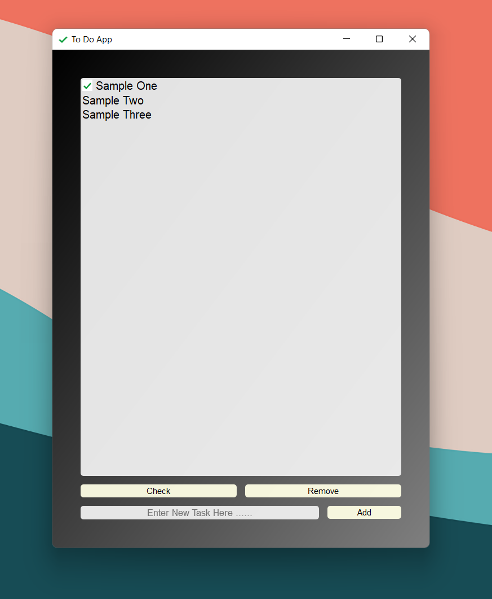

<h2>To Do App - PyQt</h2>
<h3 align=right>Aarya Jha</h3>
 

Simple To Do App using PyQt, Qt Designer with persistant storage.

 

[Reference Link](https://www.pythonguis.com/tutorials/modelview-architecture/)
 
Add-ons to the reference
<ol>
<li>
Redisigned UI
</li>
</ol>